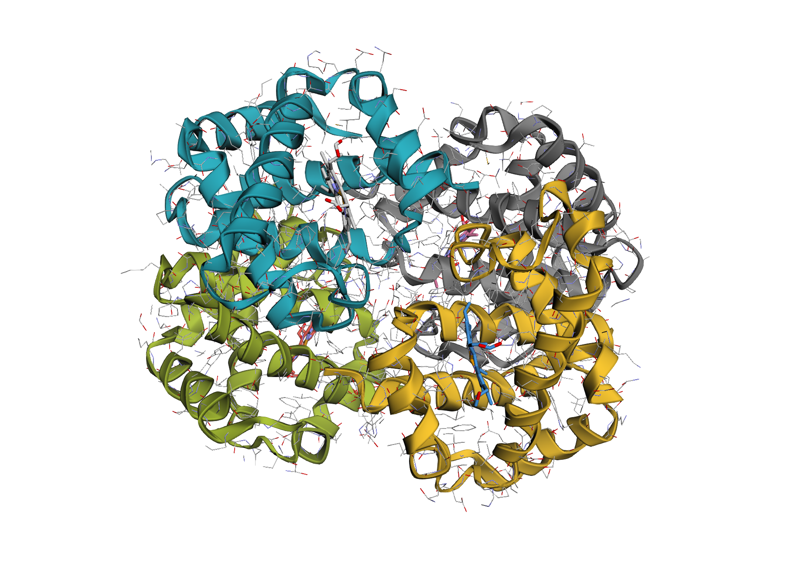
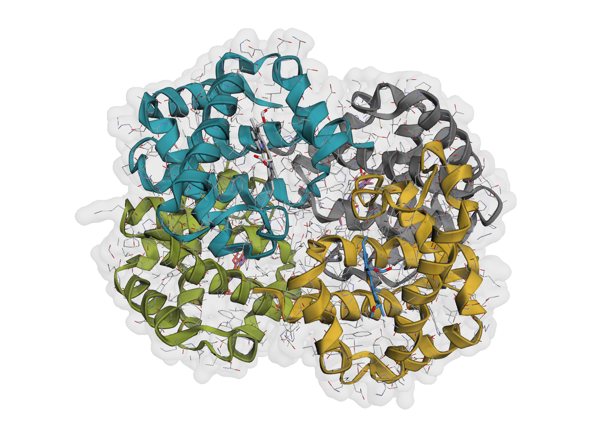
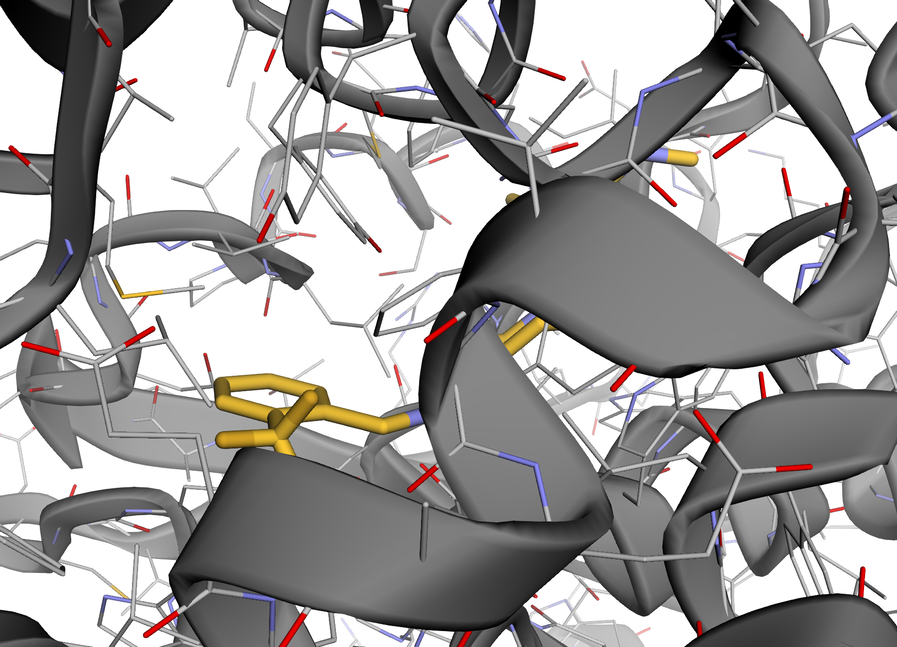
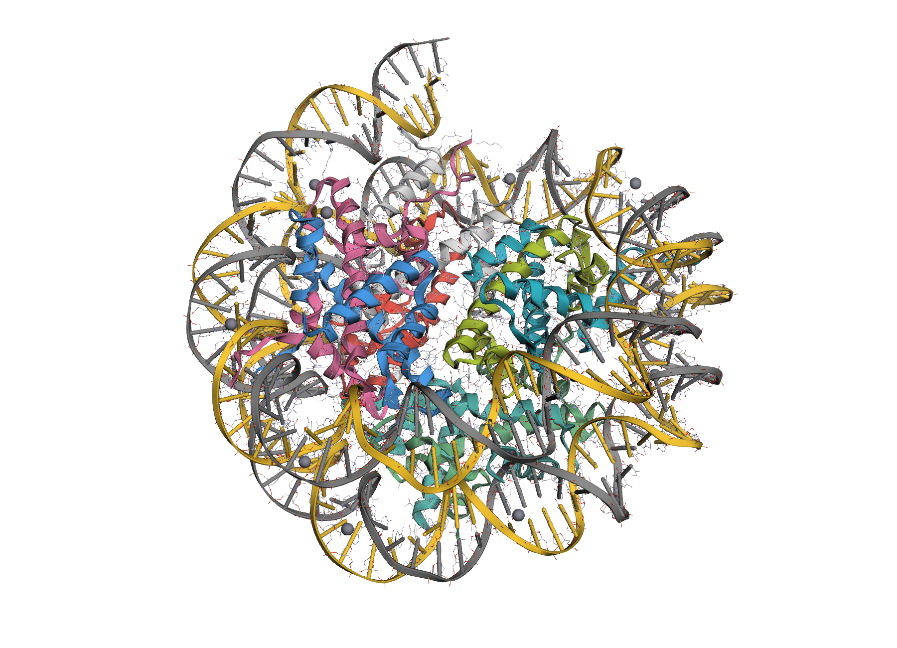

[](https://docs.astral.sh/ruff/)
[](https://github.com/astral-sh/ty)
[](https://github.com/cch1999/atomview/actions/workflows/run_tests.yml)
[](https://opensource.org/licenses/MIT)

[](https://pypi.org/project/atomview/)
<!-- [](https://atomview.readthedocs.io/en/latest/) -->


# atomview

A lightweight, standalone molecular structure viewer for Jupyter notebooks. Visualize [biotite](https://www.biotite-python.org/) `AtomArray` structures interactively using [py3Dmol](https://3dmol.csb.pitt.edu/) (3Dmol.js) — with chain-coloured cartoons, ligand sticks, ion spheres, surfaces, and hover labels out of the box.

**atomview** extracts and refactors the excellent `view()` function from [atomworks](https://github.com/RosettaCommons/atomworks) (`atomworks.io.utils.visualize`) into a focused, minimal package. If all you need is a quick way to render structures in a notebook, you no longer have to pull in atomworks and its full dependency tree (RDKit, ML tooling, dataset infrastructure, etc.).

## Installation

```bash
pip install atomview
```

Or with uv:

```bash
uv add atomview
```

## Quickstart

```python
# from urllib.request import urlretrieve
# urlretrieve("https://files.rcsb.org/download/4HHB.cif", "4hhb.cif")

from atomview import load_structure, view

structure = load_structure("4hhb.cif")

view(structure)
```

<!-- ## Features

- **One-liner visualisation** of any biotite `AtomArray` or `AtomArrayStack`
- **Automatic chain colouring** with a curated 18-colour palette
- **Smart representation** — proteins and nucleic acids get cartoon + outline sticks; ligands get element-coloured sticks; metal ions get spheres
- **Hover labels** showing chain, residue, atom name, and index
- **Optional VDW surface** overlay
- **Zoom to selection** — focus on a specific chain, residue, or atom
- **Solvent & crystallisation aid filtering** (SO4, GOL, EDO, PO4, etc.) enabled by default
- **Lightweight** — only dependson `biotite` and `py3Dmol`. -->

## Gallery

| Default protein view | Surface overlay |
|---|---|
|  |  |
| One-line rendering with automatic chain colouring. | Optional translucent VDW surface for shape context. |

| Ligand focus | Mixed complex |
|---|---|
|  |  |
| Zoom to a ligand or binding-site selection. | Proteins, nucleic acids, ligands, and ions styled together. |

## API

### `view()`

The main entry point. Returns a `py3Dmol.view` object that renders inline in Jupyter.

```python
from atomview import view

v = view(
    structure,
    show_cartoon=True,            # cartoon for polymers
    show_surface=False,           # VDW surface overlay
    show_hover=True,              # hover labels
    hide_solvent=True,            # remove water
    hide_crystallization_aids=True,
    zoom_to_selection=None,       # e.g. {"chain": "A", "resi": 35}
    width=600,
    height=400,
    colors=None,                  # custom colour list, or use defaults
)
```

## Why not just use atomworks?

[atomworks](https://github.com/RosettaCommons/atomworks) is a fantastic, comprehensive framework for biomolecular modelling maintained by RosettaCommons. But it's a big library — it bundles I/O, transforms, ML dataset tooling, RDKit integration, and more. If you just want to call `view(structure)` in a notebook, that's a lot of overhead.

**atomview** gives you exactly that one thing: a great molecular viewer with sensible defaults, in a package that installs in seconds.

## License

MIT
